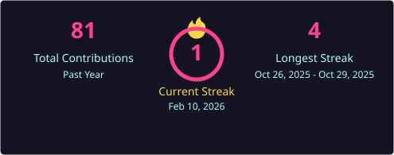

# Hi there 👋

  <!-- Typing SVG by DenverCoder1 - https://github.com/DenverCoder1/readme-typing-svg -->
  

I believe that meaning is found by paying attention to detail, and that's what programming is all about - thinking deeply about something.

Academically, I'm interested in Dynamical Systems, Signal Processing, Information Compression, Theoretical Neuroscience and Software Engineering. I also like to play chess and some instruments, cook, do powerlifting, go hiking, read and write.

📕 My latest post: [(Sustained) Attention Is All You Need](https://winkt0.substack.com/p/sustained-attention-is-all-you-need)

 

 
  
<h2>📘 Stuff I made</h2>

  

    
<picture></picture>&#8203;

    <table align="center">
      

        
        
      

    </table>
  

  

    
<picture></picture>&#8203;

    <table align="center">
      

        
      

    </table>
  

  

    
<picture></picture>&#8203;

    <table align="center">
      

        
      
      

    </table>
  

  

 
  
<h2>📕 Projects I've Contributed To</h2>

  <table align="center">
    

        
        
    

  </table>

 
  
<h2>🛠️ Tech I like</h2>

  <h3>👨‍💻 Languages </h3>

  

    
  

  <h3>🧰 Frameworks and Libraries</h3>

  

    
  

  <h3>🗄️ Databases, Cloud Hosting, DevOps</h3>

  

    
  

  <h3>💻 Software and Tools</h3>

  

    
  

 
  
<h2>📊 Stats</h2>

  
  
  
  
  <!-- https://github.com/ashutosh00710/github-readme-activity-graph -->

<!--
**winkt0/winkt0** is a ✨ _special_ ✨ repository because its `README.md` (this file) appears on your GitHub profile.

Here are some ideas to get you started:

- 🔭 I’m currently working on ...
- 🌱 I’m currently learning ...
- 👯 I’m looking to collaborate on ...
- 🤔 I’m looking for help with ...
- 💬 Ask me about ...
- 📫 How to reach me: ...
- 😄 Pronouns: ...
- ⚡ Fun fact: ...
-->
